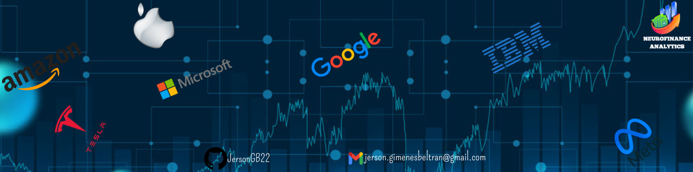

# <h1 align=center> **NeuroFinance Analytics: Global Stock Predictions with LSTM Networks** </h1>

 

## **Project Overview**:

This project was undertaken as part of the [**Advanced Data Science with IBM**](https://www.coursera.org/specializations/advanced-data-science-ibm) specialization program. It aimed to achieve a profound understanding of parallel data processing, data exploration and visualization, advanced machine learning, and deep learning, and how to apply this knowledge to a real-world practical case. The project required justifying architectural decisions and demonstrating a comprehensive grasp of different algorithms, frameworks, and technologies, and their impact on model performance and scalability.

The primary objective of this project was to forecast short-term stock prices using multivariate multi-step time series analysis with Long Short-Term Memory (LSTM) networks implemented in TensorFlow and Keras. The project focused on predicting the highest stock prices for leading companies such as Apple, Amazon, Meta, IBM, Google, Microsoft, and Tesla, for the seven days following the present, based on ten years of historical data. Seven individual LSTM models were trained, one for each company.

This project represents a significant contribution to both the field of Machine Learning and my professional career in Data Science. Advanced techniques were employed, resulting in an impressive average Root Mean Square Error (RMSE) of 6.8 USD and an average coefficient of determination (R2) of 0.92 USD when evaluating all the models. The final product was a web page with real-time interactive graphs, metrics, and filters, automatically updated daily, showcasing the results of the trained models through line charts and other informative visuals, including candlestick charts.

Key beneficiaries of this short-term stock price forecasting project include individual investors seeking informed decisions for their daily or weekly investments, active traders relying on accurate data for agile trading strategies, and portfolio managers aiming to optimize investment performance. Additionally, publicly traded companies can utilize these forecasts for precise financial planning, while financial analysts can leverage them to provide informed insights to investors and clients. These applications offer substantial value in today's financial market, making this project a valuable and relevant contribution in the realm of finance and investments.

For detailed information on the project's steps, decisions, and conclusions, please refer to the [**Documentation**](https://github.com/JersonGB22/DataScience_IBM_StockPredictionLSTM_Project/tree/main/Documentation), which is based on The Lightweight IBM Cloud Garage Method for Data Science.

## ***[Link to the Final Product of the Project](https://datascience-ibmstockpredictionlstmproject-jersonbgb.streamlit.app/)***

## **Technological Stack**
 

 

## **Contact**

